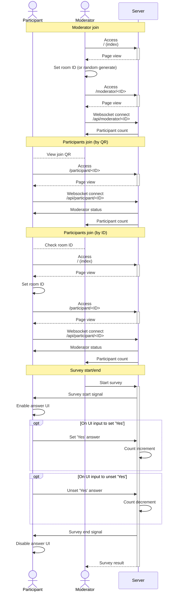

「タモリさん新宿アルタ無くなっちゃうらしいですよ？」

『無くなっちゃうらしいね！？』

リリースから 7ヶ月くらいしてからやっとの記事書きになってしまいました。てか 2月に新宿アルタ無くなって 10ヶ月、もうじき 1年やないかい。

## 作ったもの

平日お昼にやっていたテレビ番組「笑っていいとも！」、その中の名物コーナー「テレフォンショッキング」にて行われていたゲーム、「100人中 1人 (途中から 100人中X に変わった)」。その日のテレフォンショッキングゲストがスタジオ観覧 100人に質問を出し、1人 (またはゲストが決めた人数) が YES と回答したら成功、特製ストラップがもらえるヤツです。

そのシステムを自作しました。

@[card](https://iitomo-1of100.deno.dev/)

本家では専用機材と見られるものがあって、観覧客 1人1人に回答ボタンが渡されていました。ここでは人数表示板は PC、回答ボタンはスマホ (PC でも可) で実現しています。イメージはこんな感じ。

## システム設計

ごちゃごちゃ字で書くより、図で概略をつかめる方がよいでしょう。通信の流れは以下のような具合。

::::details 長いので折りたたみ

Participant: 参加者, ここでは回答用ページ

Moderator: 司会者, ここでは人数表示板ページ

:::note
ちなみにこの図は [Mermaid](https://mermaid.js.org/) で記述しました。これを記述した Markdown ファイルも[リポジトリに置いておき](https://github.com/aKuad/iitomo-1of100/blob/main/designs/sequence-diagram.md)、(簡易的ではあるが) ドキュメントとして残しました。
:::

::::

Web サーバを構築し、人数表示板ページ、回答ボタンページを用意。ページにアクセスしたら、サーバと WebSocket 通信を確立して、回答開始・終了や人数通知などのやりとりをします。

バックエンドの言語は TypeScript / JavaScript、ランタイムは [Deno](https://deno.com/) を採用。理由は [Node.js](https://nodejs.org/) の後継であることの他に、ホスティングサービス (≒レンタルサーバ) [Deno Deploy](https://deno.com/deploy) が使える点。Deno 専用ですが、無料で十分なスペックを、なんと時間制限無しで使えるのです (記事執筆時点)。費用の心配もなく、作ったシステムをネット上で公開できます。

フロントエンドはプレーン HTML, CSS, JavaScript。バックエンドも Deno ビルトインと [@std](https://jsr.io/@std) パッケージだけで、こちらもプレーンです。理由は･･･ただ私がプレーン勢なだけです。

## 工夫点

ここから本題。コードの細かい工夫点を綴っても面白みに欠けると思うので、ユーザ視点的な工夫点を綴ります。

### 想定する利用シチュエーションは

「大勢がいるパーティー会場なんかで、プロジェクタやモニタを用意してササッとスタート」

この「ササッとスタート」が大事です。なぜなら、こんなちょっとしたゲームのために、あれやこれやと用意が面倒では誰も使いたがらないからです。

ゲームの特性上、とにかく大勢に参加してもらいたい。デジタル端末に詳しい人もそうでない人も幅広く参加してもらうには、離脱率を限りなく 0 に近づける必要があります。

運営側は PC とプロジェクタ or 大型モニタ、参加者はスマホから。こんな感じの状況から「ササッとスタート」できるためには･･･。

### 最速で全員のセットアップを完了できる設計に

最速で完了、つまり必要な操作がとにかく少なく済む必要があります。この「操作」には、本アプリ以外の操作も含まれます。本アプリ以外の操作って？それはちょっと後で。

司会者は、まずはトップページへアクセス。ランダムの ID でよければそのまま「司会者」をクリック。

司会者の準備はこれだけ。

続いて回答者の準備。ここで「本アプリ以外の操作」について。

回答者ページは、特定の URL へアクセスしてもらうだけでよいのですが、この URL の共有が問題です。全員が何らかのチャットサービスでつながっていれば良いのですが、必ずしもそうとは限りません。LINE の友達登録して･･･などということを始めたら、どんどん離脱されてしまいます。そういった「本アプリ以外の操作」も減らさなくてはならないのです。

モニターを見ている全員に素早く URL を共有するには･･･そう、QR コード。司会者用画面から回答者用 QR を表示。

QR クリックで拡大表示。

参加者はスマホで QR にアクセス。

参加者の準備もこれだけ。

この通り、極限まで省ステップでセットアップが完了する設計にしました。

:::message
画像では URL が localhost でローカル上動作ですが、Deno Deploy で公開していますので、当然自家サーバを立てる必要はありません。
:::

### 説明が一切要らない UI

世の中、説明書を読みたがる人はそういません。特に本アプリのように、簡単に「ササッとスタート」したいものならなおさらです。

であれば、目指すは「説明が一切要らない、誰でも簡単に使える UI」。

司会者ページを再掲。

最も主な操作は、設定パネルの一番上に作りました。また Enter キーで操作できることもさり気なく伝授。半透明でメイン画面に重ねたコンフィグパネルは、右上の × ボタンで閉じれそうなことも漂わせつつ、PC 慣れてる人向けの Tips で Esc で表示/非表示切り替えできることも掲載 (重要度低めなので下に)。

こんな具合で、主要機能を邪魔せずに、UI に操作説明をすべて掲載することができました。機能自体そもそも多くなくてシンプルゆえに実現できたことでもあります。

次に回答者ページ。

はい。Yes/No を答えるだけですから、チェックボックス一つ、これだけです。これだけしかありませんから、誰でもきっと想像できるはずです。「あ、中央のこれで回答できそうだな」と。

逆にこれ以上なにかあると、あるいは回答開始で画面が変動してしまうと、うまく操作できない人が増える恐れがあるでしょう。

この通り、内容的にも技術的にも簡単なゲームですから、UI もそれだけ簡単にできました。

## 感想

UI 作り、自分としては自信のある一品に仕上がりました。実際に自分以外の人に使ってもらっての感想は得られていないので、本当に良い作りかは実は未検証･･･。

また、Deno Deploy が基本無料で動かせるおかげで、これまでソース公開だけだった個人開発が (簡易ながら) サービス提供という初めての形にもっていくことができました。

ところで友人に 100人中1人のネタを話しましたが、知ってる率が 20% くらいで話が弾まない()
